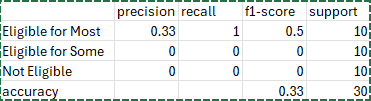

Building a classification model using patient data to classify patients as either newly
diagnosed or relapsed into one of the following classes (Lung, Prostate, CLL,
Colorectal, and Breast cancers). The model should classify the patients and
recommend open cancer clinical trials in Ireland based on the cancer subtype.
Data sources for creating patient profiles based on newly diagnosed or relapsed
patients can be created using historical clinical trials for these disease groups.
Data sources: https://www.cancertrials.ie/ (for identifying open clinical trials in ireland
and creating patient profiles)

---------------------------------------------------------------------------------------------------
**Project tasks distribution:**
Establishing a connection between our app, cancertrials.ie and clinicaltrials.gov
-Keep track of active trials, categorize cancer types- look at patient profile info provided on the website
-Find a way to link the clinicaltrials.ie link to clinicaltrials.gov. So: Expect the model to be able to find the "participation criteria" in one smooth pipeline. -Noa

-List the requirements: Inclusion and Exclusion parameters for each cancer type (just one rn but keep in mind) -Muadh

Profile of trials: (for laterzzz)
Being able to take the requested participation criteria and create a sort of "criteria" with an LLM so that we can later compare it to a patient profile.- Eryk

Fake patients dataset:
For each cancer (breast cancer only for now) type, take as much info as possible from the available trials in order to then create a small dataset of non-existing patients.- Shauna

Patient profiles (LLM):
Taking data from the patients dataset, feeding it into the LLM, classifying relapsed or newly diagnosed, fitting the data so we can compare it to the trials "criteria"- Aron

Matching patient to profile (LLM):
Taking the two inputs:
One of applicable trials criteria, one of patient profiles and finding if there exists a trial that can be matched to the patient.- Marcus

---------------------------------------------------------------------------------------------------
**To setup:**
1. Open folder in visual studio code
2. View->Terminal
3. Execute the following: 
Set-ExecutionPolicy -ExecutionPolicy Bypass -Scope Process
.venv\Scripts\activate
4. Run "testing.py"
---------------------------------------------------------------------------------------------------
The current model works as follows:
1. We train it on an artificially produced dataset of patients with eligibility criteria which has a 33/33/33 % split between the labels of: "Not eligible for any tirals", "Eligible for some", "Eligible for most". Then this is used as a sort of a "soft supervision", since no actual trial will (most likely) match perfectly with the ones created in the dataset. (Each patient's stats are created based on ALL of the inclusion/exclusion parameters I could extract from all the trials).
2. There is some rule-based matching for the exclusion criteria. This is similar to what our prof. had and you can think of it as criteria such as Age:<18 and similar.
3. LLM reasoning- I'm using Google's Flan-T5 to try and match the patients with the trials based on what it knows from above.
4. Then we have some "fuzzy matching" where the model helps match patient values to criteria even with phrasing differences.
5. It then "translates" the raw trial matches (so like 0 matches, 1, 2+) into "Not eligivble", "Eligible for some", "Eligible for most"
6. We have the evaluation.

However, here is what's essentially happening:
The model just predicts "Eligible for most" and nothing else. We can see recall is 100% for it since it guessed all of the "Eligible for most" correctly.
Precision is 33% because the other 66% it tried to guess "Eligible for most" as well... 
